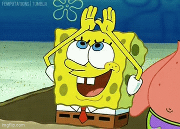

<h2 align="left">Hi 👋! My name is Hasan</h2>
---

### 🛠️ Tools & Technologies

-

---

### 📫 Contact Me

  
  
  

---

###

  

###

 

<!--### 🐍 My Contributions Snake

 -->

### 👾 Pacman Animation

<picture>
  <source media="(prefers-color-scheme: dark)" srcset="https://raw.githubusercontent.com/hasanazzam06/hasanazzam06/output/pacman-contribution-graph-dark.svg">
  <source media="(prefers-color-scheme: light)" srcset="https://raw.githubusercontent.com/hasanazzam06/hasanazzam06/output/pacman-contribution-graph.svg">
  
</picture>

