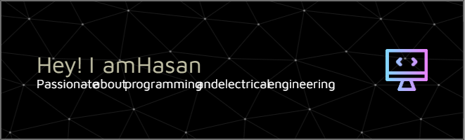

  

<h2 align="left">Hi 👋! My name is Hasan</h2>

💡 Mahasiswa Teknik Elektro yang tertarik dengan dunia IoT, sistem tertanam (embedded), dan pemrograman drone. 🚀 Saat ini sedang mengeksplorasi machine learning & penerapannya pada pesawat RC dan sistem monitoring lingkungan.

---
### 🎓 Education
- Teknik Elektro, Universitas Indonesia (2024–Sekarang)

---

### 🧠 Currently Learning
- ✈️ Drone AI (Image Recognition & Autopilot)
- 🤖 ROS2 untuk robotika
- 🌐 Web Development

---

### 🛠️ Tools & Technologies

  
  
  
  
  
  
  
  
  
  
  
  
  
  
  
  
  

---

### 📫 Contact Me

  
  
  

---

###

  

###

 

<!--### 🐍 My Contributions Snake

 -->

### 👾 Pacman Animation

<picture>
  <source media="(prefers-color-scheme: dark)" srcset="https://raw.githubusercontent.com/hasanazzam06/hasanazzam06/output/pacman-contribution-graph-dark.svg">
  <source media="(prefers-color-scheme: light)" srcset="https://raw.githubusercontent.com/hasanazzam06/hasanazzam06/output/pacman-contribution-graph.svg">
  
</picture>

